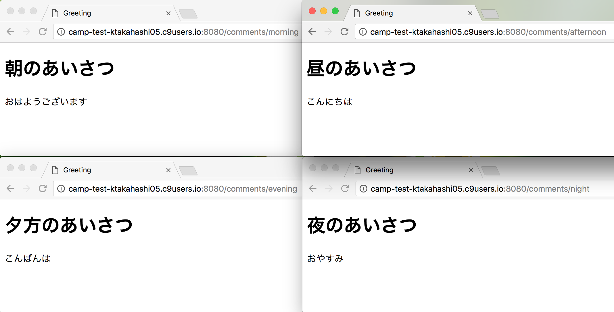
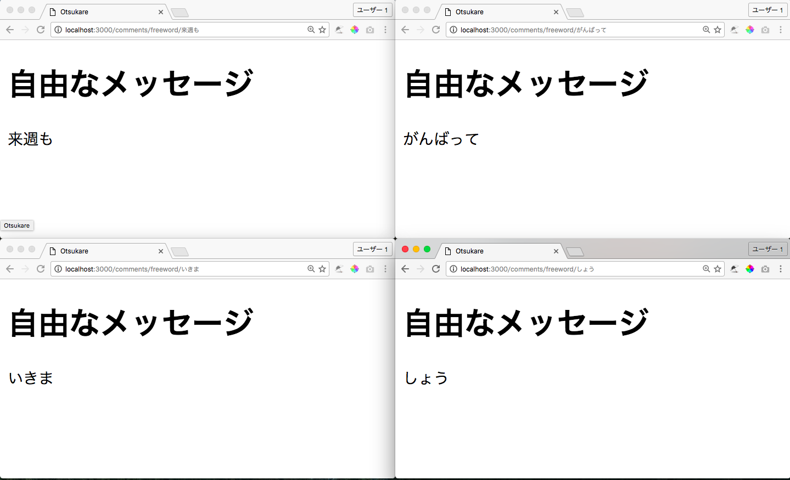
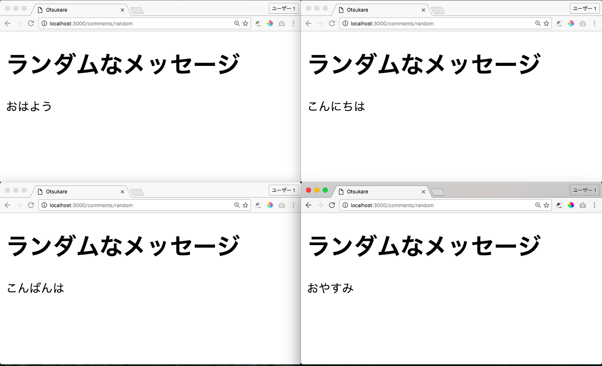

# 練習 あいさつアプリ Greetingアプリをつくろう

- VCアプリの復習になります。
- 下記のように各URLにて画像のようなHTMLが描画されるアプリを作ってみましょう。

### 完成イメージ

### 単純なあいさつ


### URLによってメッセージが変わる


### ランダムなメッセージを表示する


<br>

## アプリ作成前の準備

1. VSCode(Visual Studio Code)を起動します。  ([アプリの起動方法](/00_env/01_mac/01_mac/02.md)を参照)
2. `command` を押しながら `o` を押すとファイルを選択する画面が出ます 。
3. `camp` > `03_server_side` > `rails` ディレクトリを選んで `新規フォルダ`をクリックします。
4. `greeting` ディレクトリを作成し `開く` をクリックします。
5. `camp/docker_file`の中身(`docker` `docker-compose.yml`)を`greeting`ディレクトリ内にコピーします。（下記のコマンドでもOKです

<br>

5のコマンド

```bash
[mac] $ cp -r ~/camp/docker_file/* .
```

<br>

```diff
  greeting
+   ├ docker
+   │   ├ app
+   │   │   ├ Dockerfile
+   │   │   └ Gemfile
+   │   └ db
+   │       ├ Dockerfile
+   │       └ my.cnf
+   └ docker-compose.yml
```

docker-compose.ymlを修正します。

appコンテナー内に作成するディレクトリをアプリ名にする為、以下の部分を修正します。

```diff
  version: "3.7"
  services:
    app:
      # ビルドの設定
      build:
        # Dockerfileの場所を指定
        context: docker/app/
        # build時に使用する環境変数を指定
        args:
-         WORK_DIR: ${APP_ROOT}
+         WORK_DIR: /greeting
      # マウントするディレクトリを指定
      volumes:
        # <host-path>:<docker-path>:<option>
-       - .:${APP_ROOT}:cached
+       - .:/greeting:cached
        # <volumes>:<docker-path>
        - bundle:/usr/local/bundle
      # appコンテナとmacのport番号3000番を接続
      ports:
        - 3000:3000
      # tty(標準入出力)を使う
      tty: true
      # 連携するコンテナを指定(これでappを起動する前にdbを起動する)
      depends_on:
        - db
    db:
      # Dockerfileの相対Path
      build: docker/db/
      # 環境変数としてパスワードを設定
      environment:
        MYSQL_ROOT_PASSWORD: password
      # データの保存場所を設定
      volumes:
        - "mysql-data:/var/lib/mysql"
      ports:
        - 3306:3306
  # データを永続化
  volumes:
    # ボリュームの名前
    bundle:
    mysql-data:
```

Dockerコンテナを起動

```bash
# イメージをbuild
[mac] $ docker-compose build

# コンテナを起動 -dオプションでデタッチ
[mac] $ docker-compose up -d

# appコンテナに接続
[mac] $ docker-compose exec app bash
```

<br>

### Rails new

Rails アプリの作成します。  

```bash
[app] $ rails new .
# Gemfileがすでに存在するため、以下のメッセージが表示されるので、「y」を押した後にenterを押します。
       exist
      create  README.md
      create  Rakefile
      create  .ruby-version
      create  config.ru
      create  .gitignore
    conflict  Gemfile
Overwrite /greeting/Gemfile? (enter "h" for help) [Ynaqdh]
```

<br>

## ルーティング設計
|HTTP|URLパターン|コントローラとアクション|備考|
|:---:|:---|:---|:---|
|GET|comments/morning|comments#morning|朝のあいさつ|
|GET|comments/afternoon|comments#afternoon|午後のあいさつ|
|GET|comments/evening|comments#evening|夕方のあいさつ|
|GET|comments/night|comments#night|夜のあいさつ|
|GET|comments/freeword/:word|comments#freeword|URLの最後に入力したメッセージを表示|
|GET|comments/random|comments#random|ランダムにメッセージを表示|

## コントローラ作成
```bash:
$ bin/rails g controller comments
```

### 補足
- `rails g`は`rails generate`の省略形です
- コントローラ名は基本的に複数形です
- 下記コマンドのように、オプションを追加することで空のアクションおよびテンプレートを作ってくれる
- 今回モデルは使用しません

```bash:
$ bin/rails g controller comments morning afternoon evening night
```

以降の作業は、各自で考えながら進めてください。

### hint

ランダムに文字を表示する部分については、複数の文言を設定した配列を作成し、Rubyの<a href="https://docs.ruby-lang.org/ja/latest/method/Kernel/m/rand.html" target="_blank">rand</a>を使用して、ランダムな値を生成し、配列の中から文言を取得します。
