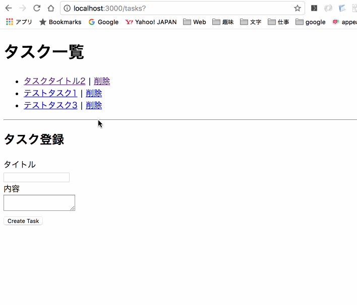

# 練習 タスク管理アプリ2

オークションアプリでは、CRUD機能の実装方法を学びました。  
今まで学んだ知識をフル活用して課題に取り組んでください.


- アプリ名を自分のGithubアカウント名+taskとして作成して下さい。
  - 例)Githubのアカウト名がtaroだった場合、「taro-task」とする。
- Github上にリポジトリを作成して下さい。
- リポジトリを作成したら、Slack上にお知らせして下さい。
  - リポジトリでSlackの紐付けを運営側で行います。
- `rails new`が終わったら"first commit"として、マスターブランチにコミットして、Githubのリポジトリにプッシュします。
  - .gitignoreの修正を忘れずに
- featureブランチを作成してから機能を作成します。
- 一通り機能が作成したら、Githubにプッシュして、プルリクエストを作成します。
- プルリクエストのURLをSlackに投稿して下さい。
  - 他の方に見られてもOKです。
- レジュメには`git init`や`git add`等のコマンドは記載してないので、自分で判断しながら作業をして下さい。


# タスク管理アプリ

## アプリ作成前の準備

1. VSCode(Visual Studio Code)を起動します。  ([アプリの起動方法](/00_env/01_mac/01_mac/02.md)を参照)
2. `command` を押しながら `o` を押すとファイルを選択する画面が出ます 。
3. `camp` > `03_server_side` > `rails` ディレクトリを選んで `新規フォルダ`をクリックします。
4. `アカウント名_task` ディレクトリを作成し `開く` をクリックします。
5. `camp/docker_file`の中身(`docker` `docker-compose.yml`)を`アカウント名_task`ディレクトリ内にコピーします。（下記のコマンドでもOKです)


<br>

```diff
  アカウント名_task
+   ├ docker
+   │   ├ app
+   │   │   ├ Dockerfile
+   │   │   └ Gemfile
+   │   └ db
+   │       ├ Dockerfile
+   │       └ my.cnf
+   └ docker-compose.yml
```

docker-compose.ymlを修正します。

appコンテナー内に作成するディレクトリをアプリ名にする為、以下の部分を修正します。

```diff
  version: "3.7"
  services:
    app:
      # ビルドの設定
      build:
        # Dockerfileの場所を指定
        context: docker/app/
        # build時に使用する環境変数を指定
        args:
-         WORK_DIR: ${APP_ROOT}
+         WORK_DIR: /アカウント名_task
      # マウントするディレクトリを指定
      volumes:
        # <host-path>:<docker-path>:<option>
-       - .:${APP_ROOT}:cached
+       - .:/アカウント名_task:cached
        # <volumes>:<docker-path>
        - bundle:/usr/local/bundle
      # appコンテナとmacのport番号3000番を接続
      ports:
        - 3000:3000
      # tty(標準入出力)を使う
      tty: true
      # 連携するコンテナを指定(これでappを起動する前にdbを起動する)
      depends_on:
        - db
    db:
      # Dockerfileの相対Path
      build: docker/db/
      # 環境変数としてパスワードを設定
      environment:
        MYSQL_ROOT_PASSWORD: password
      # データの保存場所を設定
      volumes:
        - "mysql-data:/var/lib/mysql"
      ports:
        - 3306:3306
  # データを永続化
  volumes:
    # ボリュームの名前
    bundle:
    mysql-data:
```

Dockerコンテナを起動

```bash
# イメージをbuild
[mac] $ docker-compose build

# コンテナを起動 -dオプションでデタッチ
[mac] $ docker-compose up -d

# appコンテナに接続
[mac] $ docker-compose exec app bash
```

<br>

### Rails new

Rails アプリの作成します。  

```bash
[app] $ rails new .
# Gemfileがすでに存在するため、以下のメッセージが表示されるので、「y」を押した後にenterを押します。
       exist
      create  README.md
      create  Rakefile
      create  .ruby-version
      create  config.ru
      create  .gitignore
    conflict  Gemfile
Overwrite /アカウント名_task/Gemfile? (enter "h" for help) [Ynaqdh]
```

<br>
タスク管理アプリ2を作成します。仕様は以下の通り。


### Taskモデルの概要

カラム名 | カラム名(日本語) | データ型
:---- |:---- |:----
title | タイトル| string
body | タスク内容 | text

<br>

- 画面仕様、動作は以下の通り。



## 各画面の詳細機能

### 一覧(index)

- タスクの一覧を表示する
- タスクのタイトルを押すと詳細画面に遷移する
- 削除を押すとタスクが削除される
- タスクの登録ができる
  - タイトル、内容ともに必須
  - エラーメッセージを表示する
  - 登録後は一覧画面(自画面)を表示する

### 詳細(show)
- タスクの詳細を表示する
- 編集、削除、戻るのリンクを作成
- 編集画面に遷移する
- タスクを削除し、一覧に戻る
- 戻るボタンで一覧に戻る

### 変更(edit)
- タスクを変更できる
  - タイトル、内容ともに必須
  - エラーメッセージを表示する
  - 登録後は一覧画面を表示する
- 詳細に戻るリンクで、詳細画面に戻る
